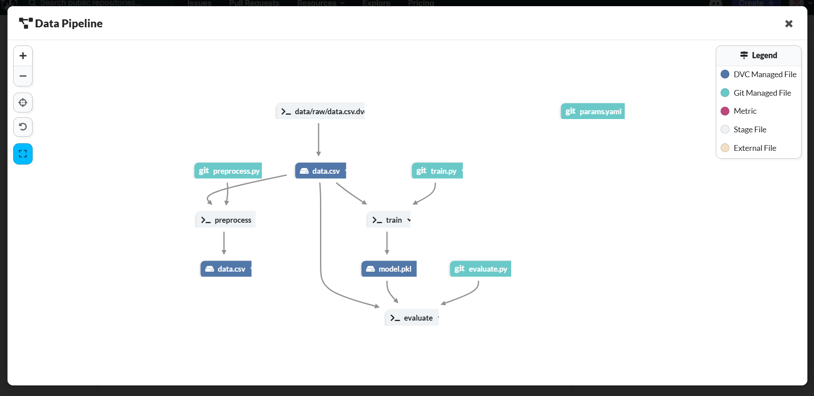

# ML Pipeline Project

This project demonstrates how to build an end-to-end machine learning pipeline using DVC (Data Version Control) for data and model versioning, and MLflow for experiment tracking. The pipeline focuses on training a Random Forest Classifier on the Pima Indians Diabetes Dataset, with clear stages for data preprocessing, model training, and evaluation.

This project is hosted on [Dagshub](https://dagshub.com/jowin-henry/MLpipeline).

## 📂 What it includes:
- 📦 Data versioning using **DVC**
- 📊 Experiment tracking with **MLflow**
- 🤖 Model training & evaluation pipeline

## Data Pipeline:

Visit the full project on Dagshub to explore all files, experiments, and logs.

